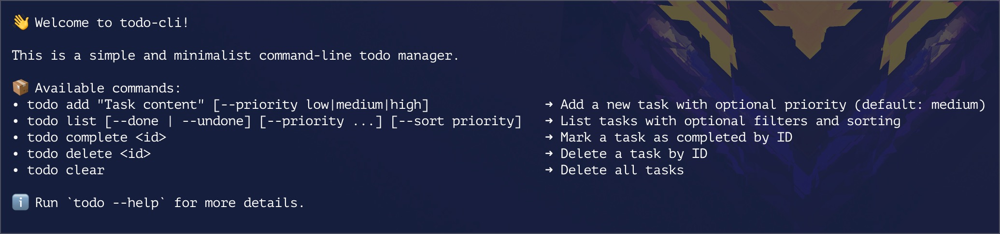

# 📝 Todo CLI X

A command-line Todo application built in Python, designed as a progressive learning project.




---

> 👉🏾 See the project [**Roadmap**](https://vidjinnangni.notion.site/Todo-CLI-Roadmap-207873f9fe5a80f38256eb0b0798e30a?source=copy_link)

## 📚 Learning Objectives

- Learn Python through hands-on practice
- Apply a clear and professional project methodology
- Deepen understanding of core concepts (modules, functions, data structures, etc.)
- Get introduced to modern tools in the Python ecosystem:
  - `uv` for dependency management
  - `pyproject.toml` for project configuration
  - Unit testing
  - `argparse` for command-line interfaces
  - And other tools/modules...
- GitHub Actions

---

## 🚀 Project Status

- ✅ Git repository initialized
- ✅ Python environment managed with [UV](https://github.com/astral-sh/uv)
- ✅ Core logic implemented (add, list, complete, delete, clear)
- ✅ Priority filtering and sorting
- ✅ Fully tested with `pytest`
- ✅ Continuous Integration (CI) set up
- ✅ CLI welcome screen and helpful feedback
- ✅ Task metadata: `created` and `due` dates
- ✅ Enhanced list display with `--verbose`
- ✅ Display of due date by default
- ✅ Support for multi-ID delete

---

## Quick Install (Recommended)

If you just want to use the `todo` CLI tool without cloning the repository, you can install it globally using [`pipx`](https://pypa.github.io/pipx/):

```bash
brew install pipx
pipx ensurepath
pipx install todo-cli-x
```

Once installed, run the CLI from anywhere in your terminal:

```bash
todo --help
todo add "Submit report" --priority high --due 2025-06-10
todo list
todo list --verbose
```

To upgrade later:

```bash
pipx upgrade todo-cli-x
```

---

## Local Development Setup

### 📂 Project Structure

```text
todo-cli/
├── src/
│   └── todo_cli/                # Main application package
│       ├── __init__.py          # Marks the directory as a Python package
│       ├── core.py              # Business logic: add, delete, list, etc.
│       └── main.py              # CLI entry point (parses commands and calls core logic)
├── tests/
│   ├── test_core.py             # Unit tests for core logic (add, list, complete, etc.)
│   └── test_utils.py            # Unit tests for utility functions (formatting, display, etc.)
├── pyproject.toml               # Project configuration (metadata, dependencies, CLI script)
├── uv.lock                      # Lock file generated by UV (resolved dependencies)
├── README.md                    # Project documentation and usage instructions
├── LICENSE                      # MIT license file
├── .gitignore                   # Git ignored files and directories
└── .python-version              # Python version used for the virtual environment (3.11)
```

Clone the repository:

```bash
git clone https://github.com/vidjinnangni/todo-cli.git
cd todo-cli
```

Set up the environment using uv:

```bash
uv sync
```

(Optional) Activate the virtual environment manually:

(macOS and Linux)

```bash
source .venv/bin/activate
```

### Task Storage

- All tasks are stored in a local file named `todo_data.json` (automatically created when needed).
- This file is **excluded from version control** (`.gitignore`) to avoid polluting the repository with user data.
- You can see an example of the file format in [`examples/todo_data.example.json`](examples/todo_data.example.json):

```json
[
  {
    "id": 1,
    "text": "Buy milk",
    "done": false,
    "priority": "medium",
    "created": "2025-06-01T12:00:00+00:00",
    "due": "2025-06-15"
  }
]
```

### Usage

Run the CLI tool without activating the environment:

```bash
uv run todo add "Submit report" --priority high --due 2025-06-10
uv run todo list
uv run todo list --verbose
```

> command `todo list`


> command `todo list --verbose`


Or activate the environment and use `todo` directly:

```bash
source .venv/bin/activate
todo add "Submit report" --priority high --due 2025-06-10
```

📚 Learn how the CLI is implemented internally → [CLI Architecture](docs/cli_explanation.md)

### Running Tests

First, install all dependencies:

```bash
uv sync --extra dev
```

Then run the tests:

```bash
uv run pytest
```

Or:

```bash
source .venv/bin/activate
pytest
```

---

## ⚖️ License

This project is licensed under the MIT License.
See the [LICENSE](/LICENSE) file for more information.

---

## 🙌 Contributions Welcome

Contributions are not only welcome – they’re encouraged! Whether you’re a beginner looking to learn or an experienced developer with suggestions, ideas, or improvements, you’re invited to participate.

> [**Roadmap**](https://vidjinnangni.notion.site/Todo-CLI-Roadmap-207873f9fe5a80f38256eb0b0798e30a?source=copy_link)

Here’s how you can contribute:

- 🐛 Report bugs — Found something that doesn’t work as expected? Open an issue!
- ✨ Suggest features — Got an idea to make the tool more useful? Share it in the discussions or issues.
- 🧹 Improve the code — Clean up logic, refactor modules, or enhance test coverage.
- 📝 Enhance documentation — Clear, friendly documentation helps everyone.
